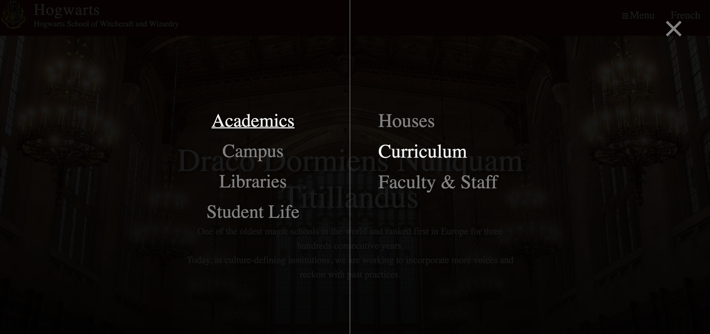
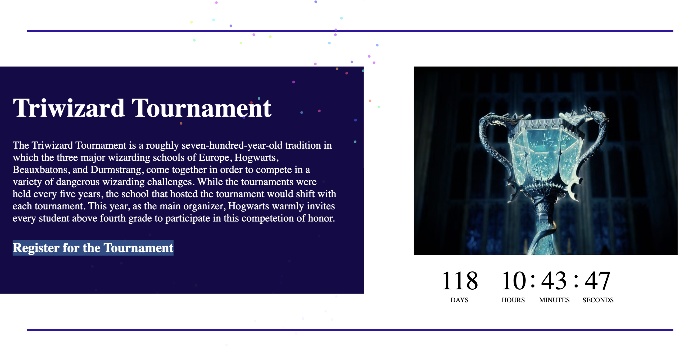

# Hogwarts
Fake school website of Hogwarts

## Introduction - French

Salut! Il s'agit d'un site Web conçu pour Hogwarts - une école de sorcellerie dans Harry Potter.

Pour des raisons de temps, je n'ai pas encore terminé toute l'infrastructure de cette plateforme. J'ai déjà fini. Index.php, Curriculum.php et Registration.php.

Il existe deux formulaires, l'un utilisant la méthode GET et l'autre la méthode POST. Le formulaire GET est utilisé pour rechercher le cours. Lorsque vous cliquez sur le bouton de menu en haut à droite de la barre de navigation et que vous cliquez sur la section « Académiques », le second choix est lié à la page curriculum.php.

  

Le formulaire de POST est utilisé pour les étudiants qui s'inscrivent au tournoi. Lorsque vous êtes sur index.php, faites défiler vers le bas jusqu'à la section "Tournoi des Trois Sorciers", vous pouvez cliquer sur le lien "S'inscrire au tournoi" pour accéder au formulaire.

  

## Introduction - English

Hi! This is a website designed for Hogwarts - a shool of Witchcraft and Wizardry in Harry Potter.

Due to the time reasons, I haven't finished all the infrastructure of this platform yet. I have already finished. Index.php, Curriculum.php and Registration.php.

There are two forms, one used the GET method and another used the POST method. The GET form is using for searching the course. When you click the menu button on the right top side of the nav bar, and click "Academics" section, the second one is related to curriculum.php page.

The post form is using for the students registering the Tournament. When you on index.php, scroll down until the "Triwizard Tournament" section, you can click the link "Register for the Tournament" for accessing to the form.

